# Pente - Android

This project is a part of the CMPS 366, [Organization of Programming Languages](https://pages.ramapo.edu/~amruth/teaching/opl/f23/opl.html) (referred colloquially with a mixture of dread, resentment, and apprehension as "OPL"), course during Fall 2023 at Ramapo College of New Jersey. Considered as the most difficult class in the Computer Science curriculum at Ramapo, the class is taken typically during the senior year; I took this class during my sophomore year. The same game is implemented in four different programming languages that are based on different paradigms: C++ (structured and object-oriented), Lisp (functional), Java/Android (object-oriented and event-driven for the GUI), and Prolog (logic). This is the Android implementation of the game.

## Implementation in Other Paradigms

### [Structured & OOP - C++](https://github.com/bibhubhatta/cmps366-pente-cpp)

### [Functional - Lisp](https://github.com/bibhubhatta/cmps366-pente-lisp)

### [Logic - Prolog](https://github.com/bibhubhatta/cmps366-pente-prolog)

## Pente

Pente is a two-player board game that is played on a 19x19 board. The game is played with black and white stones. The objective of the game is to place five stones in a row, either horizontally, vertically, or diagonally. The game is played in turns, with each player placing one stone on the board per turn. The game ends when one player has five stones in a row, or when the board is full and no player has won. The player with five stones in a row wins the game.

## Requirements of the Project

### Objective

Win by placing at least five stones in an uninterrupted line or capturing five pairs of opponent's stones while scoring as many points as possible.

### Players

One human and one computer player, playing a tournament consisting of multiple rounds.

### Setup

19x19 board with intersections labeled by columns (A-S) and rows (1-19).

### First Player

Determined by a coin toss in the first round and by points in subsequent rounds.

### Turns

The first player places a white stone at the center (J10) on the first turn and another white stone at least 3 intersections away on the second turn. Players alternate turns thereafter.

### Capturing Stones

A player can capture a pair of opponent's stones if they place their stones on both sides of the opponent's stones in a row, column, or diagonal.

### End of Round

A round ends when a player places five stones in a row or captures five pairs of opponent's stones.

### Scoring

Points are awarded for placing five stones in a row, capturing pairs of opponent's stones, and placing four stones in a row.

### Tournament

The human player can choose to play another round or end the tournament. The winner is the player with the most points.

### Computer Strategy

The computer must have strategies for creating and countering initiatives.

### User Interface

Provide a user-friendly interface with ASCII graphics and command-line input. Validate all human inputs and display the computer's moves and strategies.

### Help Mode

The computer must provide recommendations for the human player's moves upon request.

### Serialization

Allow the game to be saved and resumed later by saving the current state to a text file.

More information of the project requirements can be found at [Professor Amruth Kumar's website](https://pages.ramapo.edu/~amruth/teaching/opl/projects/pente/problem.html).

## Extra Features

These are extra features that were not part of the original requirements but were added to make the game more reliable, enjoyable, and user-friendly.

- Test-driven development: All non I/O functionalities are tested with full coverage – tests were written before the source code.

- The board can be resized into any length and width, even rectangles.
The length of the winning sequence can also be changed, so the board
is compatible with any m,n,k game. For now, the capture length of
two stones is a constant inside the capture class, but that can be
easily changed for a variable length.

- The round can be played with any number of players.

# Screenshots

## First player of the round being determined

<table>
<colgroup>
<col style="width: 33%" />
<col style="width: 33%" />
<col style="width: 33%" />
</colgroup>
<thead>
<tr>
<th style="text-align: left;">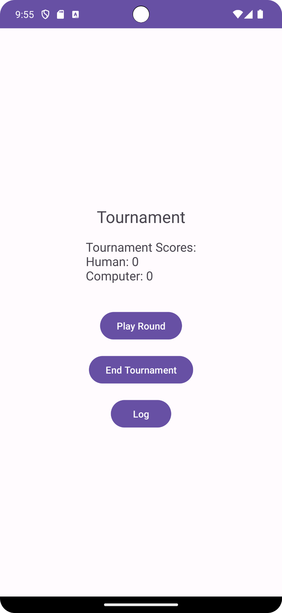</th>
<th style="text-align: left;">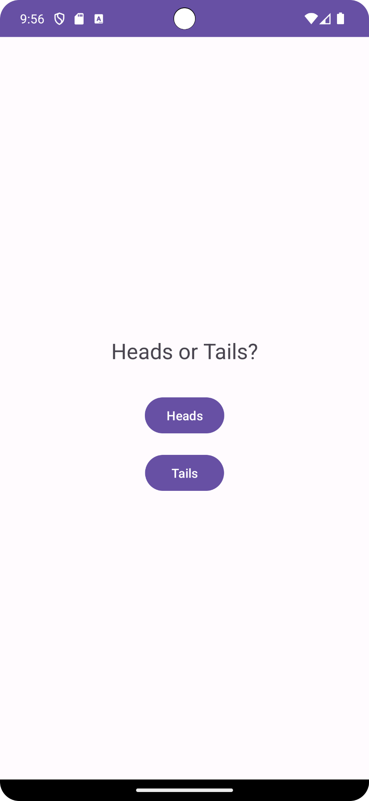</th>
<th style="text-align: left;">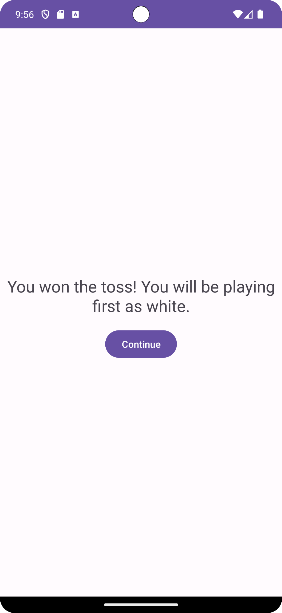</th>
</tr>
</thead>
<tbody>
</tbody>
</table>

## Computer’s move being explained

<table>
<colgroup>
<col style="width: 33%" />
<col style="width: 33%" />
<col style="width: 33%" />
</colgroup>
<thead>
<tr>
<th>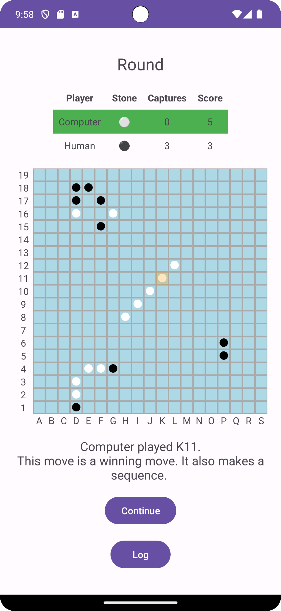</th>
<th>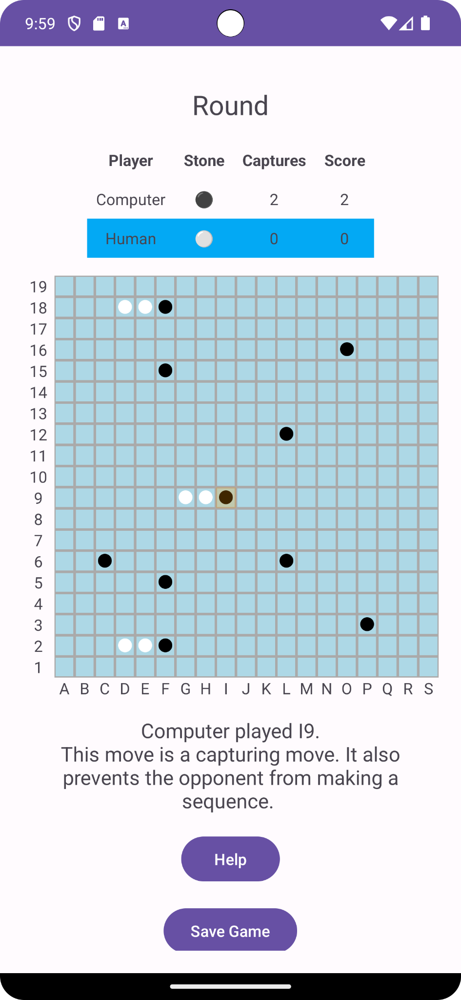</th>
<th>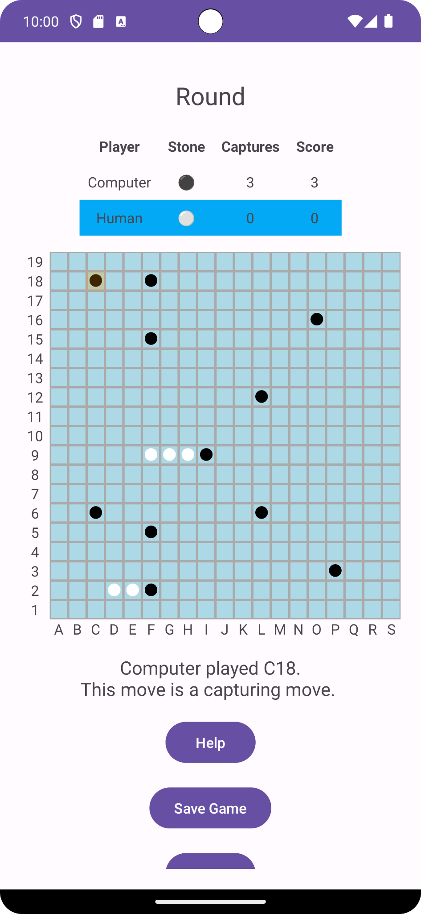</th>
</tr>
</thead>
<tbody>
</tbody>
</table>

## Computer providing help

<table>
<colgroup>
<col style="width: 33%" />
<col style="width: 33%" />
<col style="width: 33%" />
</colgroup>
<thead>
<tr>
<th style="text-align: left;">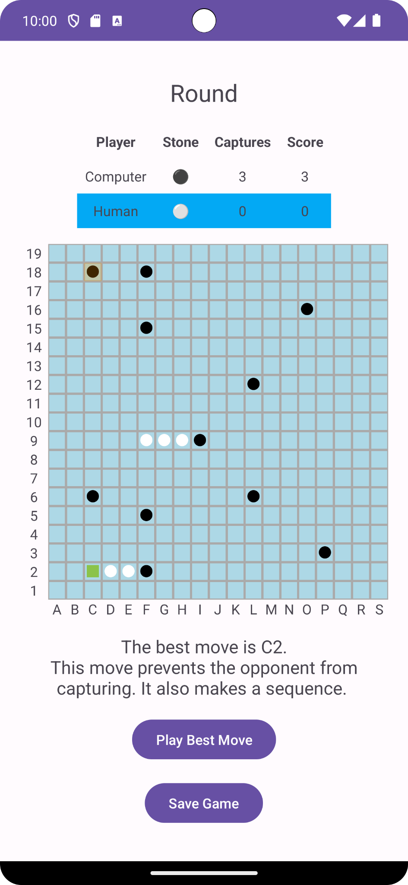</th>
<th style="text-align: left;">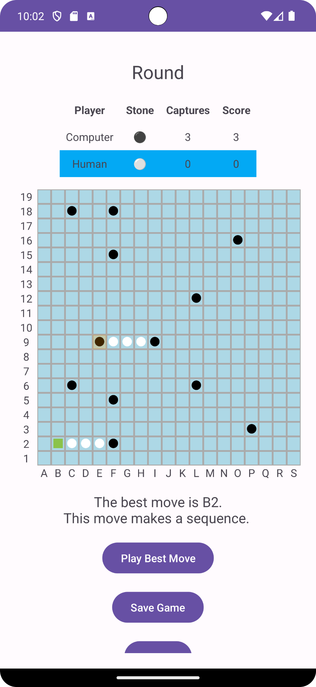</th>
<th style="text-align: left;">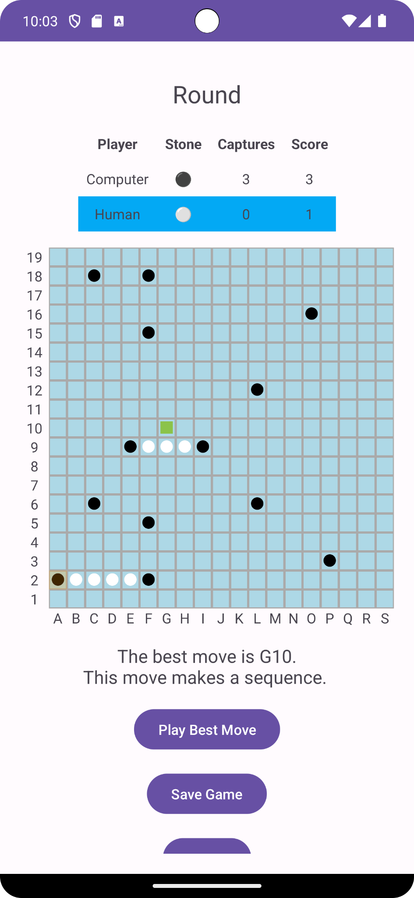</th>
</tr>
</thead>
<tbody>
</tbody>
</table>

## Winner of the round being announced

<table>
<colgroup>
<col style="width: 50%" />
<col style="width: 50%" />
</colgroup>
<thead>
<tr>
<th style="text-align: center;"></th>
<th style="text-align: left;">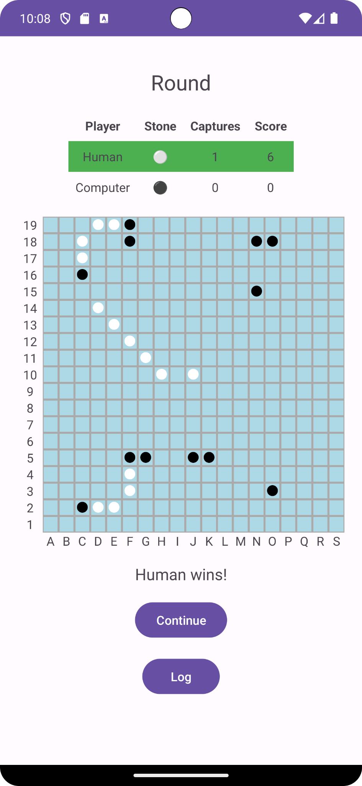</th>
</tr>
</thead>
<tbody>
</tbody>
</table>

## Winner of the tournament being announced

<table>
<colgroup>
<col style="width: 50%" />
<col style="width: 50%" />
</colgroup>
<thead>
<tr>
<th style="text-align: left;"></th>
<th style="text-align: left;">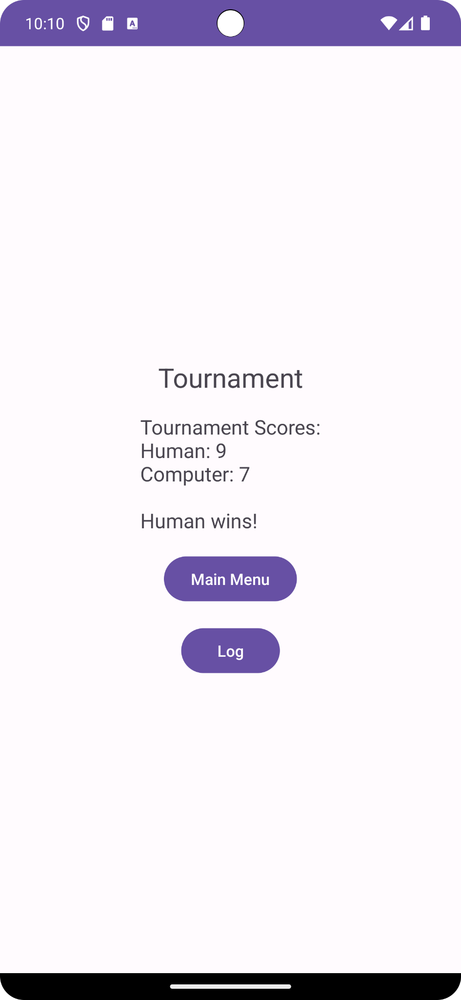</th>
</tr>
</thead>
<tbody>
</tbody>
</table>

# Description of Classes

## Models

<table>
<colgroup>
<col style="width: 16%" />
<col style="width: 83%" />
</colgroup>
<thead>
<tr>
<th>Board</th>
<th>The board used for the game</th>
</tr>
<tr>
<th>Log</th>
<th>Stores the log entries</th>
</tr>
<tr>
<th>MoveAnalyzer</th>
<th>Interface for classes that would be used to analyze moves. This is
need for the command pattern; see: <a
href="https://en.wikipedia.org/wiki/Command_pattern"><u>https://en.wikipedia.org/wiki/Command_pattern</u></a></th>
</tr>
<tr>
<th>MoveAnalysis</th>
<th>Container class for MoveAnalyzer classes that check for different
move strategies, eg. winning move, capturing move, etc.</th>
</tr>
<tr>
<th>Player</th>
<th>Represent a player and stores the name. The player class does not
make moves or store scores; It is the responsibility of the round and
tournament classes. It only identifies the player in the round and
tournaments</th>
</tr>
<tr>
<th>Position</th>
<th>Represents a position in the board; Class is used because it
contains methods to generate string representations and calculate
distances. It also has other methods such as getting neighbors and cells
in directions</th>
</tr>
<tr>
<th>Round</th>
<th>Represents a round in the game. Is responsible for making moves,
tracking captures, scores, and wins as well as validating moves</th>
</tr>
<tr>
<th>Serial</th>
<th>Parses and generates serial strings</th>
</tr>
<tr>
<th>Stone</th>
<th>Represents a stone in the board</th>
</tr>
<tr>
<th>Strategy</th>
<th>Decides on which move to play -- separated into a class from the
player so that the same player can use multiple types of strategies</th>
</tr>
<tr>
<th>Tournament</th>
<th>Represents the Tournament</th>
</tr>
</thead>
<tbody>
</tbody>
</table>

## View/Controllers

<table>
<colgroup>
<col style="width: 19%" />
<col style="width: 80%" />
</colgroup>
<thead>
<tr>
<th>CoinTossActivity</th>
<th>Performs the coin toss and initializes a round with the appropriate
player playing first</th>
</tr>
<tr>
<th>ConsolePente</th>
<th>A console implementation of the game for initial testing and
debugging</th>
</tr>
<tr>
<th>LogActivity</th>
<th>Displays the log when the log button is clicked</th>
</tr>
<tr>
<th>MainActivity</th>
<th>The main landing activity when the app is opened. Provides option to
start a new tournament or load from file</th>
</tr>
<tr>
<th>RoundActivity</th>
<th>The activity where the users play the game. It shows the captures,
scores, board, help, and option to save. Users play the game through
this activity. It also checks if it is the computer's turn and makes the
move</th>
</tr>
<tr>
<th>SaveActivity</th>
<th>Provides a text box to enter the file name and save the game state
to the downloads folder</th>
</tr>
<tr>
<th>TournamentActivity</th>
<th>Displays the tournament scores, provides the option for quitting or
starting another round. If the user quits, displays the final score and
result</th>
</tr>
</thead>
<tbody>
</tbody>
</table>

All activities have their corresponding layout xmls inside res/layout.

# Data Structures

<table>
<colgroup>
<col style="width: 19%" />
<col style="width: 80%" />
</colgroup>
<thead>
<tr>
<th><strong>Name/ Structure named defined using “using”</strong></th>
<th><strong>Description</strong></th>
</tr>
<tr>
<th>2-d Array</th>
<th>Used to store the board</th>
</tr>
<tr>
<th>ArrayList</th>
<th>Used to store stone sequences / positions when the number of items
is not known</th>
</tr>
<tr>
<th>LinkedHashMap</th>
<th>To store the player and their scores in the Tournament class, and to
store player and the player details in the round such as the stone they
are playing, the number of captured pairs, and the player after
them</th>
</tr>
</thead>
<tbody>
</tbody>
</table>
